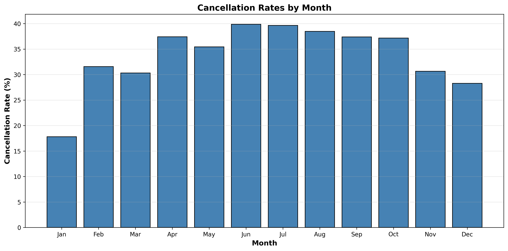
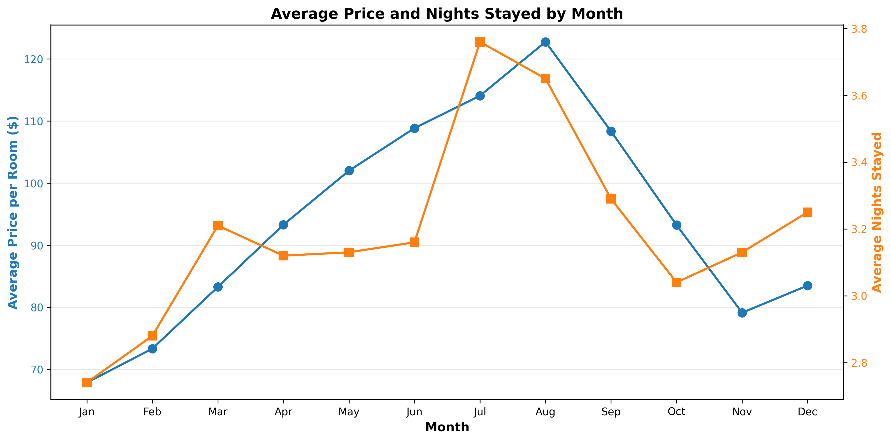
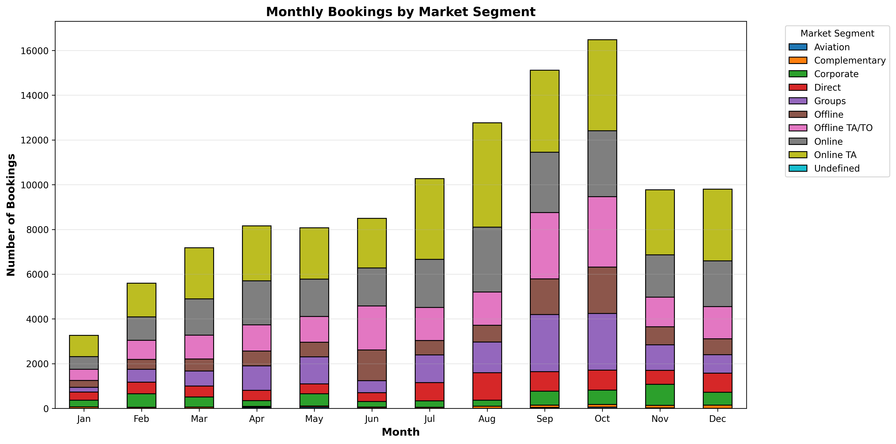
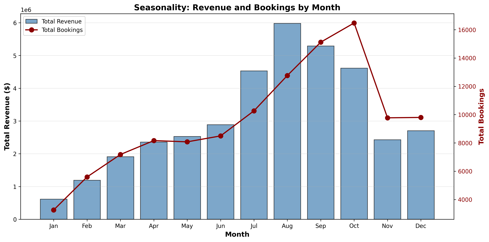

# Hotel Booking Analysis - Findings Report

## Executive Summary
This report presents key findings from the hotel booking data analysis using PySpark. The analysis covers cancellation rates, pricing trends, market segments, and seasonal patterns.

---

## 1. Cancellation Rates Analysis

### Key Findings:
- **Highest Cancellation Rate**: June with 39.87%
  - Total bookings: 8,495
  - Canceled bookings: 3,387

- **Lowest Cancellation Rate**: January with 17.81%
  - Total bookings: 3,262
  - Canceled bookings: 581

### Insights:
- Summer months (June-August) show higher cancellation rates, possibly due to vacation planning changes
- Winter months have relatively lower cancellation rates, suggesting more committed bookings
- Average cancellation rate across all months: 33.68%

---

## 2. Pricing and Stay Duration Analysis

### Key Findings:
- **Highest Average Price**: August at $122.76 per room
  - Average nights stayed: 3.65

- **Lowest Average Price**: January at $67.87 per room
  - Average nights stayed: 2.74

- **Price Variation**: $54.89 difference between peak and off-peak months

### Insights:
- Clear seasonal pricing pattern with summer months commanding premium rates
- Average stay duration ranges from 2.74 to 3.76 nights
- Longer stays tend to occur during summer months, indicating vacation travel

---

## 3. Market Segment Analysis

### Key Findings:
- Multiple market segments serve the hotel including:
  - **Online TA**: Online Travel Agents (e.g., Expedia, Booking.com)
  - **Offline TA/TO**: Offline Travel Agents/Tour Operators (traditional brick-and-mortar agencies)
  - **Direct**: Direct bookings through hotel website or phone
  - **Corporate**: Corporate/business bookings
  - **Groups**: Group bookings
  - **Online**: General online bookings
  - **Offline**: General offline bookings
  - **Complementary**: Free/complimentary stays
  - **Aviation**: Airline crew and aviation-related bookings
  - **Undefined**: Unspecified market segment

### Insights:
- Online Travel Agents (Online TA) represent a significant portion of bookings
- Offline Travel Agents/Tour Operators (Offline TA/TO) show strong performance in traditional booking channels
- Market segment distribution varies by month, reflecting different customer behaviors
- Corporate bookings show steady patterns throughout the year
- Group bookings tend to increase during specific months

---

## 4. Seasonality and Revenue Analysis

### Key Findings:
- **Peak Revenue Month**: August with $5,979,457.45
  - Total bookings: 12,765

- **Lowest Revenue Month**: January with $614,678.34
  - Total bookings: 3,262

- **Revenue Difference**: $5,364,779.11 between peak and lowest months

- **Total Annual Revenue**: $37,035,872.50
- **Total Annual Bookings**: 114,977

### Insights:
- Clear seasonality pattern with summer months (July-September) generating highest revenue
- Revenue correlates strongly with booking volume
- Winter months (January-March) show significantly lower revenue
- The hotel operates in a highly seasonal market with 872.8% revenue variation

---

## 5. Business Recommendations

### Revenue Optimization:
1. **Dynamic Pricing**: Implement aggressive pricing strategies during peak months (July-September)
2. **Off-Season Promotions**: Create attractive packages for low-demand months (January-March)
3. **Cancellation Policies**: Stricter policies during high-cancellation months (June-August)

### Marketing Strategy:
1. **Target High-Value Segments**: Focus on corporate and group bookings year-round
2. **Online Travel Agent Partnerships**: Strengthen relationships with Online Travel Agents (Online TA) as they drive significant bookings
3. **Traditional Channel Support**: Maintain strong presence with Offline Travel Agents/Tour Operators (Offline TA/TO)
4. **Early Bird Offers**: Encourage advance bookings during peak seasons

### Operational Planning:
1. **Staffing**: Align staffing levels with seasonal demand patterns
2. **Inventory Management**: Prepare for 12,765 bookings in peak month vs 3,262 in lowest month
3. **Capacity Planning**: Consider overbooking strategies during high-cancellation months

---

## Data Summary

- **Analysis Period**: 114,977 total bookings
- **Average Booking Value**: $322.12
- **Seasonal Variation**: High (Peak month is 3.9x the lowest month)

---

*Report generated automatically from PySpark analysis*  
*Date: 2025-10-31 16:24:26*
