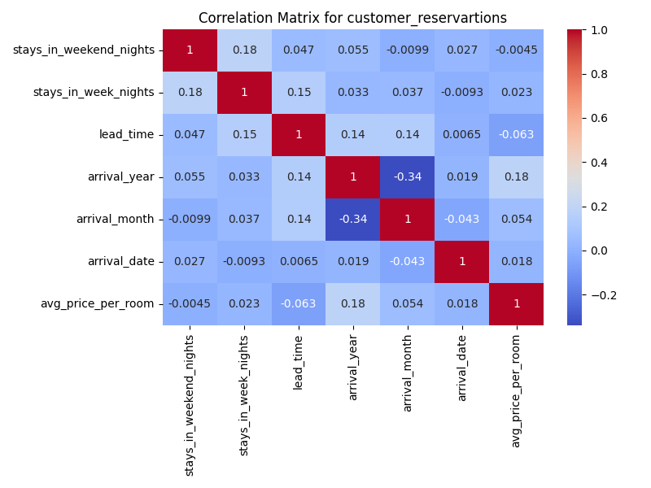
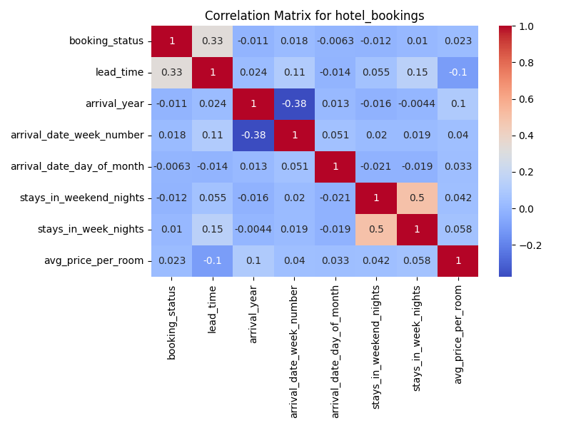

# Phase 1: Data Preparation & EDA in Spark  
**Course:** CS236 — Database Managenebt System  
**Authors:**  
- **Pankaj Sharma** (SID: 862549035)
- **Saransh Gupta** (SID: 862548920)  

---

## 0. Executive Summary
In this phase, we set up a local PySpark environment, used two CSV datasets (`customer-reservations.csv` and `hotel-booking.csv`), performed exploratory data analysis (EDA), and data preprocessing.  

---

## 1. Installation Process

### 1.1 Unpack the Project
```bash
unzip CS236-Project.zip
cd CS236-Project
```

### 1.2 Creating a Virtual Environment
```bash
python3 -m venv venv
source venv/bin/activate
```

### 1.3 Install Dependencies
```bash
pip install -r requirements.txt
```

### 1.4 Installing Java 11
```bash
brew install openjdk@11
export JAVA_HOME=/opt/homebrew/opt/openjdk@11/libexec/openjdk.jdk/Contents/Home
export PATH="/opt/homebrew/opt/openjdk@11/bin:$PATH"
```

### 1.5 Running the Script
```bash
export JAVA_HOME=/opt/homebrew/opt/openjdk@11/libexec/openjdk.jdk/Contents/Home \
&& export PATH="/opt/homebrew/opt/openjdk@11/bin:$PATH" \
&& spark-submit phase1-eda.py
```

## 2. Exploratory Data Analysis Process
This sections contains EDA process and findings that we performed on the datasets - `customer-reservations.csv` and `hotel-booking.csv`. Here we will answer What, Why and Insights we gained from the EDA steps that we performed.

---

### 2.1 Schema Inspection

#### Customer Reservations Schema

| Column Name | Data Type | Nullable |
|--------------|------------|-----------|
| Booking_ID | string | True |
| stays_in_weekend_nights | integer | True |
| stays_in_week_nights | integer | True |
| lead_time | integer | True |
| arrival_year | integer | True |
| arrival_month | integer | True |
| arrival_date | integer | True |
| market_segment_type | string | True |
| avg_price_per_room | double | True |
| booking_status | string | True |

---

#### Hotel Bookings Schema

| Column Name | Data Type | Nullable |
|--------------|------------|-----------|
| hotel | string | True |
| booking_status | integer | True |
| lead_time | integer | True |
| arrival_year | integer | True |
| arrival_month | string | True |
| arrival_date_week_number | integer | True |
| arrival_date_day_of_month | integer | True |
| stays_in_weekend_nights | integer | True |
| stays_in_week_nights | integer | True |
| market_segment_type | string | True |
| country | string | True |
| avg_price_per_room | double | True |
| email | string | True |


#### Why:
We did this step to confirm proper loading of datasets using PySpark and to get brief idea about the dataset like columns and its data types.

#### Insights:
- *Customer Reservations:* This Dataset contains columns of different data types. We have Numeric fields such as `lead_time`, `arrival_year`, and `avg_price_per_room`, and categorical fields like `market_segment_type` and `booking_status` were `StringType`.  
- *Hotel Bookings:* This Dataset contains columns of 2 data types. `arrival_month` was inferred as a `StringType` (e.g., "July", "September"), while other date components were integers.  

--- 

### 2.2 Size Inspection

#### Why:
We did to check the size of the database in order to fit within Spark in memory limits.

#### Insights:
- *Customer Reservations:* **36,275 rows × 10 columns** — each row represents one unique booking (`Booking_ID`).  
- *Hotel Bookings:* **78,703 rows × 13 columns** — includes additional contextual fields such as `hotel`, `country`, and `email`.  
- Both datasets are of moderate size and fit comfortably within Spark's in-memory analysis limits.

### 2.3 Missing Values
#### Missing Values Count — Customer Reservations

| Column Name | Missing Values |
|--------------|----------------|
| Booking_ID | 0 |
| stays_in_weekend_nights | 0 |
| stays_in_week_nights | 0 |
| lead_time | 0 |
| arrival_year | 0 |
| arrival_month | 0 |
| arrival_date | 0 |
| market_segment_type | 0 |
| avg_price_per_room | 0 |
| booking_status | 0 |

**Note:** Customer Reservations Dataset does not have `arrival_date_week_number` field. However, during data preprocessing, we calculate it from the existing date components (year, month, day) using ISO 8601 week numbering to ensure compatibility with the Hotel Bookings Dataset.

---

#### Missing Values Count — Hotel Bookings

| Column Name | Missing Values |
|--------------|----------------|
| hotel | 0 |
| booking_status | 0 |
| lead_time | 0 |
| arrival_year | 0 |
| arrival_month | 0 |
| arrival_date_week_number | 0 |
| arrival_date_day_of_month | 0 |
| stays_in_weekend_nights | 0 |
| stays_in_week_nights | 0 |
| market_segment_type | 0 |
| country | 405 |
| avg_price_per_room | 0 |
| email | 0 |

#### Why:
We did this step to find incomplete fields to decide whether to remove them or to fill in mean value.

#### Insights:
- *Customer Reservations:* **0 missing values** across all the columns.  
- *Hotel Bookings:* Only the `country` column contained **405 missing values** all other columns were complete.  
- Overall both the datasets were almost complete with only Hotel Bookings Dataset having very less percentage of missing values.

---

### 2.4 Distinct Values Inspection

#### Distinct Values Count — Customer Reservations

| Column Name | Distinct Count |
|--------------|----------------|
| Booking_ID | 36,275 |
| stays_in_weekend_nights | 8 |
| stays_in_week_nights | 18 |
| lead_time | 352 |
| arrival_year | 2 |
| arrival_month | 12 |
| arrival_date | 31 |
| market_segment_type | 5 |
| avg_price_per_room | 3,930 |
| booking_status | 2 |

---

#### Distinct Values Count — Hotel Bookings

| Column Name | Distinct Count |
|--------------|----------------|
| hotel | 2 |
| booking_status | 2 |
| lead_time | 439 |
| arrival_year | 2 |
| arrival_month | 12 |
| arrival_date_week_number | 53 |
| arrival_date_day_of_month | 31 |
| stays_in_weekend_nights | 17 |
| stays_in_week_nights | 32 |
| market_segment_type | 8 |
| country | 159 |
| avg_price_per_room | 6,985 |
| email | 77,144 

#### Why:
This is essential EDA process which results in determining primary keys, redundancy and also helps in process of prediction.

#### Insights:
- *Customer Reservations:*  
  - `Booking_ID` had **36,275 unique values**, which means every row can be uniquely identified from the `Booking_ID` hence it can be used as a primary.  
  - `market_segment_type` had **5 categories** and can be used to draw significant inference from the data.  
  - `booking_status` had **2 values** — *Canceled* and *Not_Canceled*.  
  - No duplicate rows found.  
- *Hotel Bookings:*  
  - `hotel` had 2 values (*City Hotel*, *Resort Hotel*).  
  - `market_segment_type` had 8 categories.  
  - `country` had 159 unique codes.  
  - `email` had 77,144 unique entries, nearly matching total rows, implying one booking per customer.  

---

### 2.5 Correlation Inspection

#### Correlation map - Customer Reservations


#### Correlation map - Hotel Bookings


#### Why: 
This steps helps us in finding strong and weak relationships between continuous variables.
 
#### Insights:
- **Customer Reservations**
  - `stays_in_week_nights` and `stays_in_weekend_nights` show a **moderate positive correlation (0.18)** which seems reasonable as customers might extend their stays for the weekend if booked initially for the week days.
  - `lead_time` has **very weak or no correlation** with `avg_price_per_room` (≈ -0.06). This insight was kind of surprising as booking earlier had little or no effect in average room price.
  - Other relationships are near zero, confirming that most numeric fields (dates, lead time, price) are largely independent.

- **Hotel Bookings**
  - `stays_in_week_nights` and `stays_in_weekend_nights` have a **strong positive correlation (~0.50)** with same reasoning as above.
  - `lead_time` and `booking_status` are **positively correlated (~0.33)** which means bookings made far in advance are slightly more likely to be canceled.  
  - `lead_time` and `avg_price_per_room` show a **weak negative correlation (-0.10)** — earlier bookings tend to be marginally cheaper.
  - Other variables show near-zero correlations, suggesting minimal temporal dependencies.

---

### Summary

Both the datasets are well structured and mostly clean. With EDA steps performed, we were able to find some useful insights from the datasets. These findings are useful in next steps of the data pre processing. 

---
---

# Data Merge & Integration

## 1. Dataset Overview

### 1.1 Source Datasets

We merged two hotel booking datasets:
- Customer reservations: 36,275 records from customer booking system (no duplicates)
- Hotel bookings: 78,703 records from hotel management system (1 duplicate removed during cleaning → 78,702 records)
- Total merged: 114,977 records

## 2. Key Challenges

### 2.1 Different Column Names for Same Data

| Customer Reservations Dataset | Hotel Bookings Dataset      | Issue |
|-------------------------------|-----------------------------|-------|
| `Booking_ID`                  | N/A                         | Hotel data lacks booking identifiers |
| `arrival_date`                | `arrival_date_day_of_month` | Different naming for same field |

### 2.2 Different Data Formats

| Field | Customer Reservations Format      | Hotel Bookings Format             |
|-------|-----------------------------------|-----------------------------------|
| `booking_status` | Text ('Canceled', 'Not_Canceled') | Binary (0, 1)                     |
| `arrival_month` | Numeric (1-12)                    | Text ('January', 'February', ...) |

### 2.3 Missing Columns

| Dataset | Missing Columns | Resolution |
|---------|----------------|------------|
| Customer Reservations | hotel, country, email, arrival_date_week_number | Added (hotel, country, email as NULL; week_number calculated) |
| Hotel Bookings | booking_id | Generated with INN prefix and offset |

---

## 3. Data Cleaning Decisions

### 3.1 Customer Reservations Dataset

#### Column Standardization
- Renamed `Booking_ID` → `booking_id` for consistency
- Renamed `arrival_date` → `arrival_date_day_of_month` for clarity

#### Missing Column Handling

| Column Added | Value | Rationale                                                            |
|--------------|-------|----------------------------------------------------------------------|
| `hotel` | NULL | Customer Reservations system doesn't track hotel type                |
| `country` | NULL | Geographic information not available                                 |
| `email` | NULL | Privacy/data availability limitation                                 |
| `arrival_date_week_number` | Calculated | Computed from arrival_year, arrival_month, arrival_date_day_of_month |

#### Week Number Calculation
The customer reservations dataset doesn't include week numbers, but we can derive them from the existing date components:

```python
# Construct date from year, month, day components
date_string = concat_ws('-', year, padded_month, padded_day)
arrival_date = to_date(date_string)

# Extract ISO week number (1-53)
arrival_date_week_number = weekofyear(arrival_date)
```

#### Why:
- Maximizes data completeness by deriving missing information
- Uses ISO 8601 week numbering standard
- Enables consistent week-based analysis across both datasets
- Using NULL for hotel, country, and email follows database best practices for truly missing data

#### Duplicate Removal
- Checked for duplicate rows using all fields
- No duplicates found in customer reservations dataset

---

### 3.2 Hotel Bookings Dataset

#### Booking Status Standardization
- **Original:** Binary (0 = not canceled, 1 = canceled)
- **Target:** Text ('Not_Canceled', 'Canceled')

```python
when(col('booking_status') == 0, 'Not_Canceled').otherwise('Canceled')
```

#### Why:
- Matches customer reservations dataset format
- Self-documenting (no need to remember 0/1 mapping)
- Prevents accidental numeric operations on categorical data

---

#### Arrival Month Conversion
- **Original:** Text ('January', 'February', ..., 'December')
- **Target:** Numeric (1-12)

#### Why:
- Matches customer reservations dataset format
- Enables numeric operations (sorting, filtering, calculations)
- Reduces storage space
- Facilitates time-series analysis

---

#### Booking ID Generation
- **Format:** INN50000, INN50001, INN50002, ...
- **Offset:** Starting at 50,000

#### Why:
Customer Reservations Dataset Booking IDs range from INN00001 to INN36275. Starting hotel IDs at 50,000 prevents ID collision while maintaining the same INN prefix pattern.

---

#### Duplicate Removal
- Found 1 duplicate record in Hotel Bookings Dataset
- Removed during cleaning process

---

### 3.3 Final Merged Dataset Transformations

#### Boolean Conversion
- **Field:** `booking_status` → `is_canceled`
- **Format:** Boolean (True/False)

#### Why:
- Database-ready format (PostgreSQL BOOLEAN type)
- More efficient storage (1 byte vs 12+ bytes for text)
- Enables boolean operators in queries
- Clearer semantic meaning

#### ID Simplification
- **Field:** `booking_id` → `id`

#### Why:
Shorter, simpler column name for the primary identifier.

---

## 4. Schema Alignment Strategy

### 4.1 Unified Column Set

The following 14 columns were standardized across both datasets:

| Column Name | Data Type | Description |
|-------------|-----------|-------------|
| `booking_id` | String | Unique booking identifier |
| `hotel` | String | Hotel type (or NULL) |
| `booking_status` | String | Cancellation status |
| `lead_time` | Integer | Days between booking and arrival |
| `arrival_year` | Integer | Year of arrival |
| `arrival_month` | Integer | Month of arrival (1-12) |
| `arrival_date_week_number` | Integer | ISO week number (or calculated) |
| `arrival_date_day_of_month` | Integer | Day of month |
| `stays_in_weekend_nights` | Integer | Weekend nights booked |
| `stays_in_week_nights` | Integer | Weekday nights booked |
| `market_segment_type` | String | Market segment |
| `country` | String | Country code (or NULL) |
| `avg_price_per_room` | Double | Average room price |
| `email` | String | Customer email (or NULL) |

---

## 5. Merge Methodology

### 5.1 Union vs Join Decision

**Chosen Approach:** UNION (vertical concatenation)

```python
merged_df = customer_aligned.union(hotel_aligned)
```

#### Why:
- Datasets represent independent booking sources
- No natural join key exists between them
- Goal is to combine all records, not match them
- Preserves all records from both sources

**Alternative Considered:** JOIN operation  
**Why Rejected:** Would require matching keys and could lose records; datasets are complementary, not overlapping.

---

### 5.2 Duplicate Detection and Removal

Duplicates are removed at the individual dataset level before merging:
- **Customer Reservations:** Checked and found 0 duplicates
- **Hotel Bookings:** Found and removed 1 duplicate record (Lisa_M@gmail.com with identical booking details)

---

## 6. Final Schema

### 6.1 Merged Dataset Structure

**Total Columns:** 14

| Column | Type | Constraints |
|--------|------|-------------|
| `id` | String | Primary identifier |
| `hotel` | String | Nullable |
| `is_canceled` | Boolean | Not null |
| `lead_time` | Integer | Not null |
| `arrival_year` | Integer | Not null |
| `arrival_month` | Integer | Not null |
| `arrival_date_week_number` | Integer | Not null |
| `arrival_date_day_of_month` | Integer | Not null |
| `stays_in_weekend_nights` | Integer | Not null |
| `stays_in_week_nights` | Integer | Not null |
| `market_segment_type` | String | Not null |
| `country` | String | Nullable |
| `avg_price_per_room` | Double | Not null |
| `email` | String | Nullable |

---

## 7. Key Decisions Summary

### 7.1 Data Quality
- **NULL Representation:** Missing data stored as NULL (blank in CSV) rather than placeholder strings
- **Duplicate Handling:** Business-logic-based deduplication catching semantic duplicates
- **ID Strategy:** Offset-based ID generation preventing collisions between datasets

### 7.2 Database Readiness
- **Boolean Fields:** booking_status converted to is_canceled boolean
- **Consistent Types:** All data types aligned and validated
- **Primary Key:** Unique id field for every record

### 7.3 Data Lineage
- **Customer Reservation Records:** INN00001 - INN36275 (36,275 records)
- **Hotel Booking Records:** INN50000 - INN128702 (78,702 records after deduplication)
- **Total Records:** 114,977 unique bookings

---

## 8. Summary

The data merge process successfully unified two independent booking systems into a single, clean dataset suitable for analysis and database import. Key achievements include:

1. **Schema Harmonization:** Resolved naming and format inconsistencies
2. **Data Quality:** Removed duplicates and standardized missing data handling
3. **Database Compatibility:** Converted to database-friendly formats (booleans, NULLs)
4. **Data Integrity:** Prevented ID collisions through offset strategy
5. **Complete Traceability:** All decisions documented with clear rationale

The resulting merged dataset provides a comprehensive view of hotel bookings across both systems, ready for downstream analysis and database integration.
